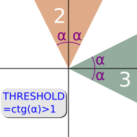
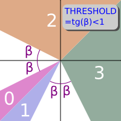

# Задача 1

Коллега отправил вам файл, но вы нигде не можете найти константу VECTOR_NAME. Нужно восстановить ее, опираясь на этот блок кода.

```js
const getVector = ({x, y}) => {
    if (x > y) {
        if (Math.abs(x / y) < THRESHOLD) return;
        return x > 0 ? 3 : 1;
    } else {
        if (Math.abs(y / x) < THRESHOLD) return;
        return y > 0 ? 2 : 0;
    }
};

let v = getVector({x: _x, y: _y});
if (v && VECTOR_NAME.indexOf(v) !== -1) {
    ev.emit('event.' + VECTOR_NAME[v]);
}

ev.on('event.up', () => {
    console.log('Восхитительно, что-то движется вверх!');
});
```

# Ответ

Функция getVector() определяет четыре зоны в векторном пространстве, и возвращает индекс, соответствующий зоне, в которой находится вектор, или не возвращает ничего, если вектор не попал ни в одну из зон.

Этот индекс используется для генерации события, название которого соответствует зоне, в которой находится вектор. Таким образом, событие, и соответствующие обработчики привязаны к зоне, в которой находится вектор.

Наличие и вид зон зависит от значения константы порога (THRESHOLD). Если THRESHOLD > 1, то мы получим только зоны с индексами 2 и 3:



Если THRESHOLD < 1, то будут присутствовать все четыре зоны:



Один из обработчиков, судя по фразе в консольном выводе, связан с направлением вверх. Если принять, что речь идёт о направлении вектора, связанного с данным обработчиком, то однозначно этому обработчику соответствует зона 2. Поэтому

`VECTOR_NAME[2] === 'up'`

Для зоны 3 почти однозначно можно принять соответствие движению вправо. Поэтому можно предположить, что

`VECTOR_NAME[3] === 'right'`

Если такой подход верен, то остальные зоны, пользуясь той же логикой, также можно связать с названиями направлений.

Итоговое значение константы:
`VECTOR_NAME === ['left', 'down', 'up', 'right']`
